<style>
body {
text-align: justify}
</style>

```{r setup, include=FALSE}
knitr::opts_chunk$set(echo = TRUE,warning=FALSE, message=FALSE, error=FALSE)
```

```{r, echo=F}
library(ggplot2) 
library(DESeq2)
library(edgeR)
options(connectionObserver = NULL)
library(org.Hs.eg.db)
library(EnsDb.Hsapiens.v86)
library(ggpmisc)
library(patchwork)
library(stringr)
library(magrittr)
library(rtracklayer)
library(plyranges)
library(tidyr)
library(tidyverse)
library(rjson)
library(RColorBrewer)
library(ggfortify)
library(pvclust)
library(ggdendro)
library(knitr)
library(kableExtra)
theme_set(theme_light())
```

# Introduction

High-throughput whole transcriptome RNA sequencing (RNA-seq) technology has enabled a new era of biomedical and clinical research by providing unprecedented high-resolution view of the global transcriptional landscape[@kukurba_rna_2015]. For instance, the technology is used routinely to obtain the most comprehensive genome-wide view of the transcriptome, study differential expression patterns [cite many] and allele-specific expression (ASE), analyze splicing and alternative splicing mechanism [cite]. Beyond surveying gene expression levels, RNA-seq can also be applied to investigate genome-wide transcriptional changes, such as chimeric gene fusions, single nucleotide variants, insertions, and deletion events [@wang_rna-seq_2009]. Moreover, RNA-seq enabled many novel assays that can be used to to invistigate chromotaine accessibility (e.g ATAC-seq)[@buenrostro_atac-seq_2015], transcriptor factor binding preferences (e.g ChIP-seq) [@park_chipseq_2009], RNA binding proteins binding sites (e.g CLIP-seq) [@hafner_clip_2021]. The capabilities of RNA-seq technology makes it an increasingly adapted technology for the systematic characterization of whole transcriptomes in many organisms and diseases [@marioni_rna-seq_2008].

The consistency and the accuracy of RNA-seq data are critical to ensure that the conclusions of these studies are not flawed. Multiple library preparation steps may introduce potential factors that can confound the experiments, including sample preparation, sequencing platforms, and bioinformatics analysis tools. Many of these factors were studied in depth, but less attention was given to different sample preparation, including RNA isolation, sample handling, library storage time, RNA input level, and sample cryopreservation [@wang_exploring_2019].

In this project, we investigate the potential consequences of cDNA library storage time and sample cryopreservation on gene level characterization of RNA-seq experiments. **Our hypothesis is that RNA-seq data is sensitive to sample preparation factors and that can affect the gene expression profiles of the experiments.**.


# Results

The analysis of the possible effects of library storage time and sample cryopreservation shows that the two factors has minor to no effect on the RNA-seq experiments. Figure 1 and 2 shows PCA plot for studying the impact of library storage time and sample cryopreservation, respectively. We see that the samples from the same patient are closest despite the library storage time and sample cryopreservation. The same observation is seen when looking at the hierarchical clustering of the samples as shown in Figure 3 and 4. For future analysis, we may consider adding more samples to the experiment to get a higher confidence on the results. Also, for the library storage time, it would be better to get samples from different time points to point out the main features of the RNA-seq data that change with time. For sample cryopreservation study, we may consider compare different freezing technologies to make a more informed decision when choosing to store samples for an extended period of time. Other than these two factors that were studied here, we can also look at other library preparation steps like, RNA input concentration to obtain a full picture of possible confounding factors.


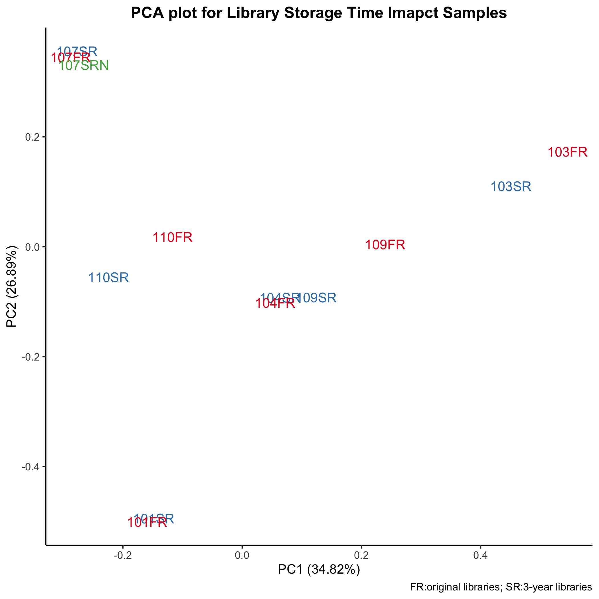{width=80%}

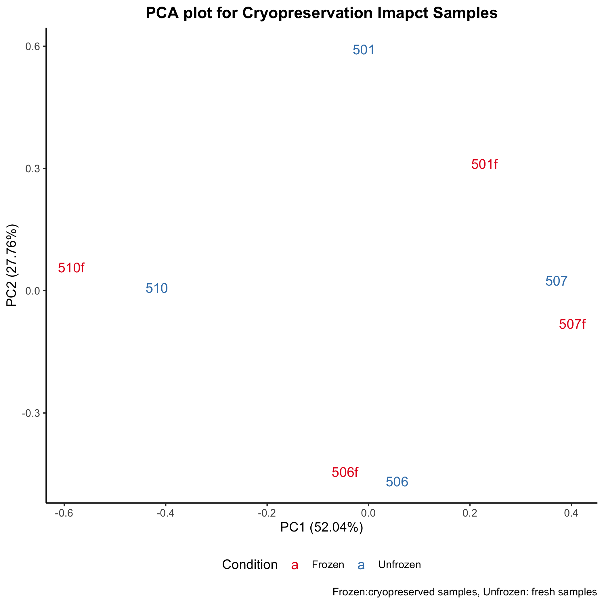{width=80%}

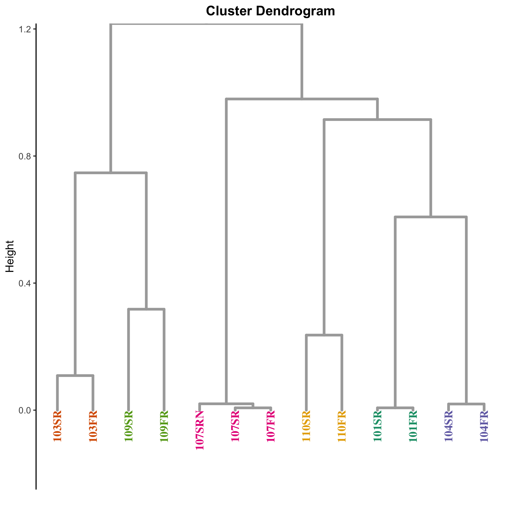{width=80%}

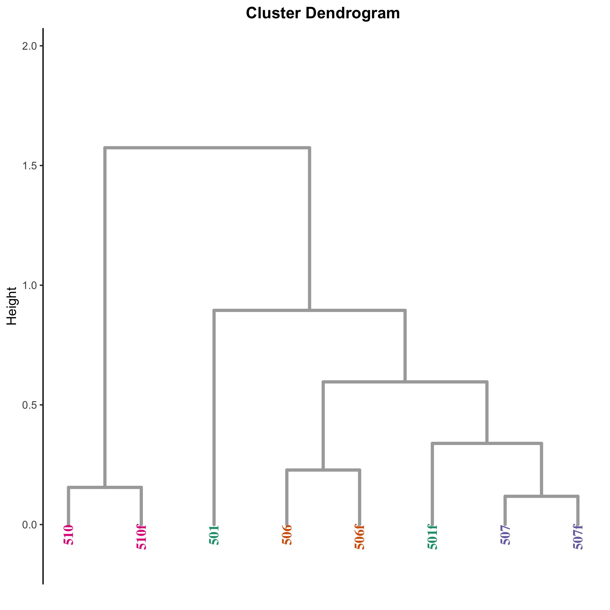{width=80%}


# Methods

## Dataset

The data that will be used for this project are from [GSE110417](https://www.ncbi.nlm.nih.gov/geo/query/acc.cgi?acc=GSE110417). the data contains 21 samples, that are either B cells or CD4+ cells isolated from freshly drawn peripheral blood. 13 samples used to investigate the library storage time. The samples are grouped into two: the first group contains samples from 6 patients sequenced with original cDNA library, and the second group contains samples for the same patients but prepared with a cDNA library stored at -80 degrees for three years, with an addition of a sample from a patient prepared with a newly constructed cDNA library. Finally, to investigate the impact of the sample cryopreservation on RNA-seq experiments, fresh and cryopreserved CD4+ samples derived from 4 patients were used, totaling to 8 samples. The sample considered fresh were derived from freshly isolated cells and stored as cell lysates in Qiazol, while the samples considered frozen, peripheral blood mononuclear cells (PBMCs) were isolated from fresh whole blood then frozen in Cosmic calf serum containing 5% DMSO at −80 degrees. The cDNA libraries were prepared using mRNA TruSeq v.2 (Illumina) and Illumina HiSeq 2000 instrument was used to sequence all the samples.

```{r}
Samples <- read.csv('SraRunTable.txt')
more_details <- read.csv('samples_title.csv')
Samples <- merge(x=Samples, y=more_details, by='Sample_geo_accession')
Samples <- Samples[, c('Sample_title','Run','Cell_type', 'AvgSpotLen', 'Platform', 'LibraryLayout','Instrument', 'LibrarySelection', 'LibrarySource')]
kable(Samples) %>% kable_styling() %>% scroll_box(width = "100%", height = "200px")
```

## Download FASTQ files

For my project the data I intend to use is stored in SRA repository. To download the data from SRA, I used `sra-toolkit` to fetch and extract the fastq files.
First I obtained the SRR accession list for all the fastq files for the project. I obtained the list from `SRA Run Selector` using the `GEO accession number: GSE110417` [ here](https://www.ncbi.nlm.nih.gov/Traces/study/?acc=PRJNA433678&o=acc_s%3Aa). 

The following command is used to download all the files:
```{bash prefetch, eval=FALSE}
prefetch --option-file SRR_Acc_List.txt
```

The downloaded files are not a proper `.fastq` files that can be processed, instead `SRA-toolkit` downloads `.sra (Sequence Read Archive)`  files. The next step `fastq-dump` tool (there is a faster tool named `fasterq-dump` that was not found on the cluster) is use to extract the `fastq` files from these archive files. The following script is used to extract all the files:

```{bash fastq-dump, eval=FALSE}
#! /bin/bash -l
#SBATCH --partition=angsd_class #SBATCH --nodes=1
#SBATCH --ntasks=1
#SBATCH --job-name=SRATofastq
#SBATCH --time=24:00:00 # HH/MM/SS
#SBATCH --mem=8G # memory requested, units available: K,M,G,T
outFile=${DownloadSRA}_${SLURM_JOB_ID}.txt
echo "Starting at:" `date` >> ${outFile}
echo "This is job #:" $SLURM_JOB_ID >> ${outFile}
echo "Running on node:" `hostname` >> ${outFile}
echo "Running on cluster:" $SLURM_CLUSTER_NAME >> ${outFile}
echo "This job was assigned the temporary (local) directory:" $TMPDIR >> ${outFile}

spack load -r sra-toolkit
for file in *.sra; do
   echo "File Name: " $file >> ${outFile}
   fastq-dump --split-files --gzip $file
done
exit

```

The parameters that are used in the previous step are `--split-files` and `--gzip`. The first one is used to save the pair-end reads to two separate files, and the second is used to save the extracted `fastq` file to `gzip` compressed file. The documentation from the tool are displayed below:

```{bash commands, eval=FALSE}
--split-files    Dump each read into separate file.Files 
                 will receive suffix corresponding to read 
                 number 
--gzip           Compress output using gzip                  
```


## Data Processing

### QC Analysis

First, I took a look at the FastQC analysis of one sample and found that there are were two sequences over-represented, so I decided to run `Trimglore` on all sequences. Figures 5-9 shows the results of FastQC analysis for all the library storage time samples reported using `MultiQC`. The samples for cryopreservation experiments shows the same trends as well. Figure 10 shows the length of trimmed sequences after running `Trimglore`.

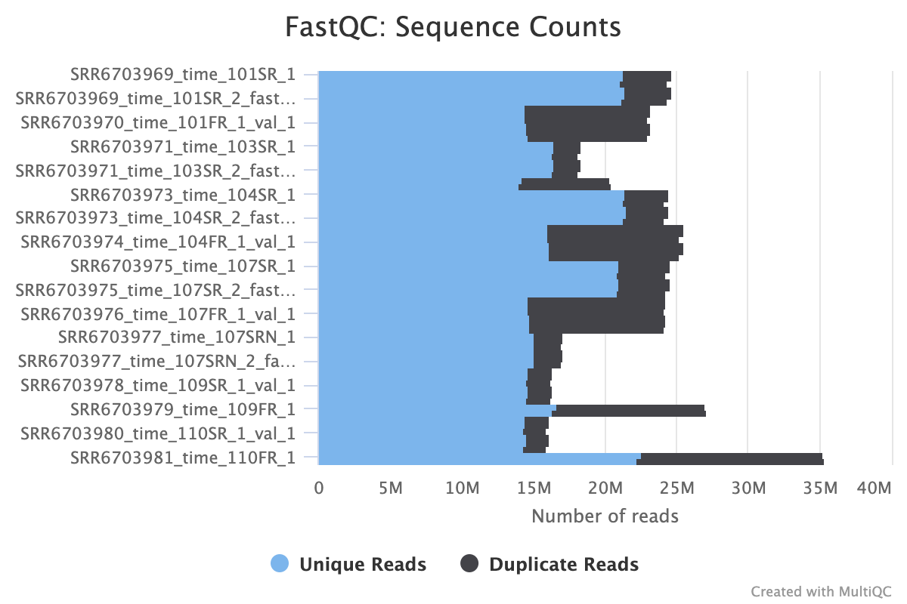{width=80%}


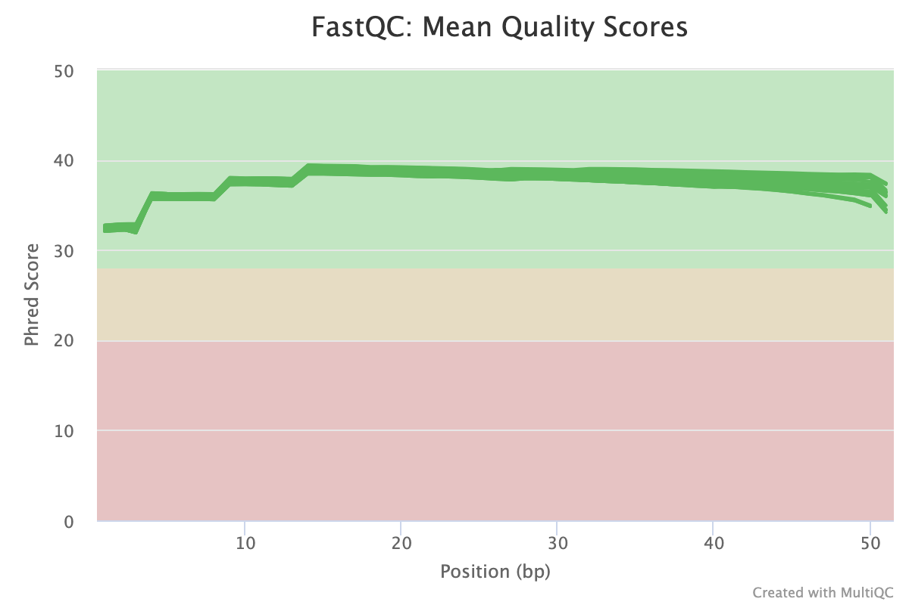{width=80%}


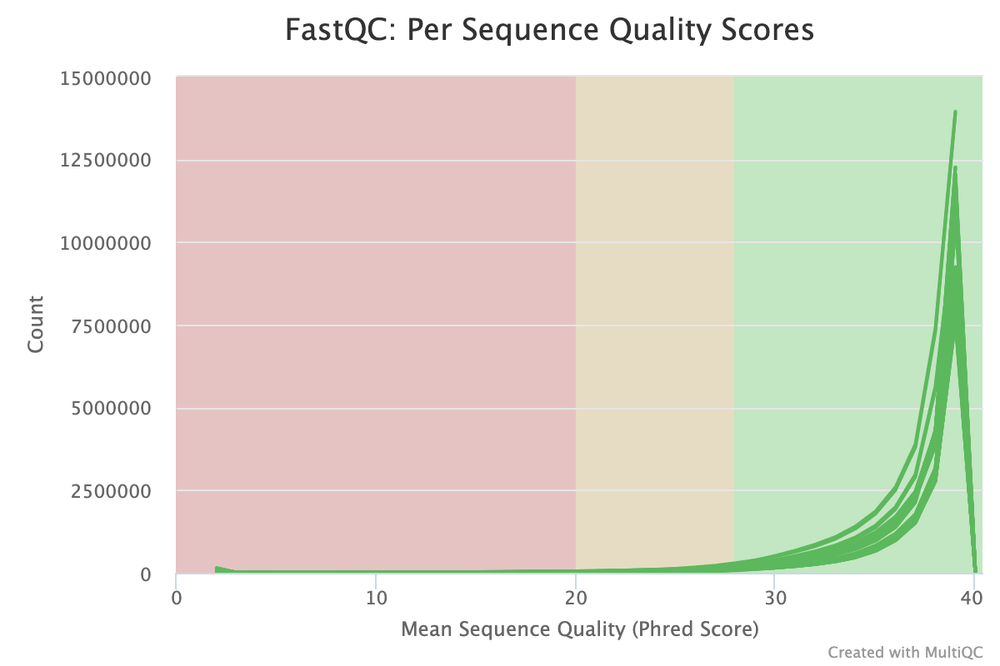{width=80%}


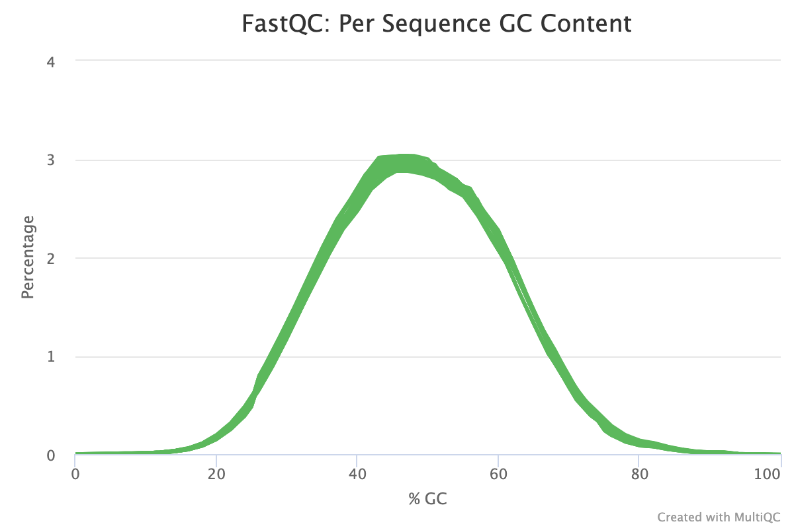{width=80%}


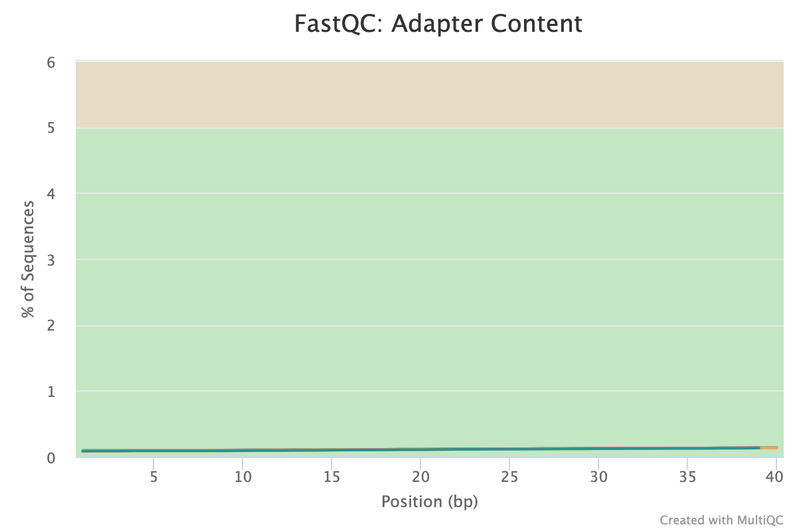{width=80%}


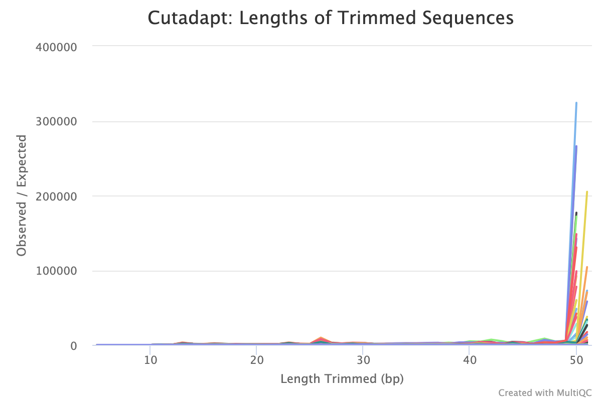{width=80%}


### Generate Index

Next step was to create the index files for our specie's genome to align the reads. Since the samples for the project are from human, the human genome hg38 build was downloaded. For the annotation file we have different choices that we can use depending on the use case. Since we are not dealing with special annotation Ensemble gene annotation file `hg38.ensGene.gtf.gz` was used. The files were download from [UCSC Browser](https://hgdownload.soe.ucsc.edu/goldenPath/hg38/bigZips/). The following script was used to generate the index:

```{bash indexing, eval=FALSE }
#! /bin/bash -l

#SBATCH --partition=angsd_class
#SBATCH --nodes=1
#SBATCH --ntasks=16
#SBATCH --job-name=IndexGenerator
#SBATCH --time=12:00:00 # HH/MM/SS
#SBATCH --mem=36G # memory requested, units available: K,M,G,T
outFile=IndexAlign_${SLURM_JOB_ID}.txt
echo "Starting at:" `date` >> ${outFile}
echo "This is job #:" $SLURM_JOB_ID >> ${outFile}
echo "Running on cluster:" $SLURM_CLUSTER_NAME >> ${outFile}
echo "This job was assigned the temporary (local) directory:" $TMPDIR >> ${outFile}

spack load star@2.7.0e


mkdir ${TMPDIR}/ilb4001
tmp=/scratchLocal/ilb4001

echo "Copying files to" ${tmp} >> ${outFile}

# Copy genome and annotation file
cp $SLURM_SUBMIT_DIR/hg38.fa ${SLURM_SUBMIT_DIR}/hg38.ensGene.gtf ${tmp}

# Copy sample read fastq files
cp $SLURM_SUBMIT_DIR/fastq_trimmed/SRR6703962_1_val_1.fq ${SLURM_SUBMIT_DIR}/fastq_trimmed/SRR6703962_2_val_2.fq ${tmp}

# Check that all the files were copied without an error
echo "tmp content..."
ls ${tmp} | cat >> ${outFile}

############################Indexing######################################
resultFolder=${tmp}/hg38_STARindex
mkdir ${resultFolder}

echo "STAR genomeGenerate...." >> ${outFile}

STAR --runMode genomeGenerate \
--runThreadN 16 \
--genomeDir ${resultFolder} \
--genomeFastaFiles hg38.fa \
--sjdbGTFfile hg38.ensGene.gtf \
--sjdbOverhang 49 \
|& tee ${outFile}


echo "copying the generated index...." >> ${outFile}
cp -r ${resultFolder}/* ${SLURM_SUBMIT_DIR}/genome/hg38_STARindex/
```


Apart from the input parameters, I set the `--sjdbOverhang` parameter to 49 since the length of the reads is 50 bp.

### Alignment

After generating the index for the reference genome, the next step was to align the reads. For that I used `STAR` alignment tool. **Note: the files are pair-end reads**. Figure 11 shows the percentages of different aligned reads. We can see that more than 95% of the reads were mapped, and a small percentage of the reads was not mapped. The script for aligning and generating the QC plots is in the full script at the end of the section.


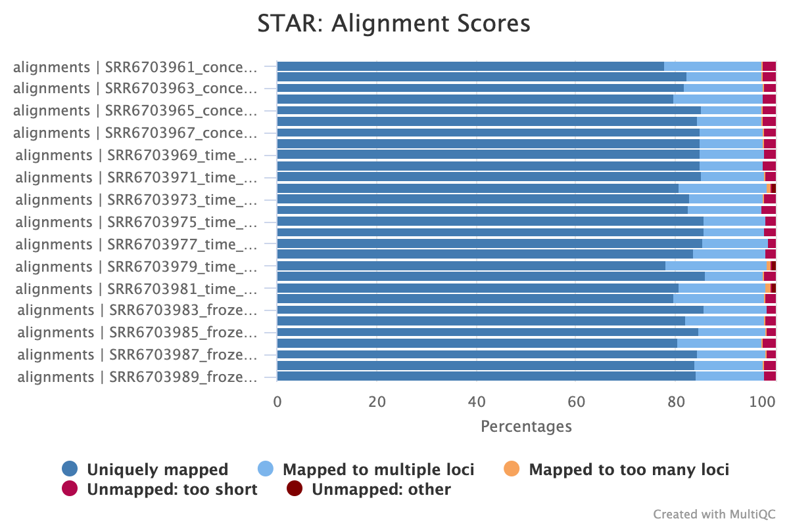{width=80%}


To get the distribution of mapped read counts in the different genomic regions, I used the annotation bed file for housekeeping genes `hg38.HouseKeepingGenes.bed`. The reason for doing that is to speed up the process, as using the annotations for the whole genome was taking way too much time to process. The results of the analysis is discussed in the following sections.


### Feature Count

Once the reads were aligned, I used `featureCounts` tool to generate the feature count for each sample in my dataset. The main parameters I set for the tool are:

1. `-a`: the gtf annotation file was set to hg38.ensGene.gtf
2. `-t`: the feature level to use for reads counting was set to 'exon'
3. `-p`: Since we have pair-end reads, we count the fragments instead of reads. fragments are specified by the two paired-end reads


**The script below was used to perform all the steps, except index generation.**

```{bash, eval=F}
#! /bin/bash -l

#SBATCH --partition=angsd_class
#SBATCH -w buddy.pbtech
#SBATCH --nodes=1
#SBATCH --ntasks=16
#SBATCH --job-name=ProcessAll
#SBATCH --time=48:00:00 # HH/MM/SS
#SBATCH --mem=36G # memory requested, units available: K,M,G,T
outFile=ProcessAll_${SLURM_JOB_ID}.txt
echo "SLURM_SUBMIT_DIR:" ${SLURM_SUBMIT_DIR}  >> ${outFile}
echo "Starting at:" `date` >> ${outFile}
echo "This is job #:" $SLURM_JOB_ID >> ${outFile}
echo "Running on node:" `hostname` >> ${outFile}
echo "Running on cluster:" $SLURM_CLUSTER_NAME >> ${outFile}
echo "This job was assigned the temporary (local) directory:" $TMPDIR >> ${outFile}

spack load -r fastqc
spack load -r trimgalore
spack load star@2.7.0e
spack load samtools@1.9% gcc@6.3.0
spack load subread
spack load -r py-rseqc@2.6.4

mkdir /scratchLocal/ilb4001
tmp=/scratchLocal/ilb4001
fatqDir=${tmp}/raw_data
mkdir ${fatqDir}

echo "Copying fastq files to" ${fatqDir} >> ${outFile}
cp $SLURM_SUBMIT_DIR/raw_data/SRR67*.fastq.gz ${fatqDir}

mkdir ${tmp}/fastqc
FastQCDir=${tmp}/fastqc

echo "Start fastqc...." >> ${outFile}
fastqc $(ls ${fatqDir}/SRR67*.fastq.gz) --extract -o ${FastQCDir} |$ tee ${outFile}

mkdir ${tmp}/fastq_trimmed
TrimDir=${tmp}/fastq_trimmed
echo "Start TrimGalore" >> ${outFile}
trim_galore --gzip --illumina  --fastqc --fastqc_args "--outdir ${FastQCDir}" --paired  --stringency 5 -o ${TrimDir}  $(ls ${fatqDir}/SRR67*.fastq.gz)


mkdir ${tmp}/genome
GenomeDir=${tmp}/genome
echo "Copying Genome files" >> ${outFile}
cp -r $SLURM_SUBMIT_DIR/genome/hg38_STARindex ${GenomeDir}
cp $SLURM_SUBMIT_DIR/genome/hg38.ensGene.gtf ${GenomeDir}
cp $SLURM_SUBMIT_DIR/genome/hg38.HouseKeepingGenes.bed ${GenomeDir}


AlignmDir=${tmp}/alignments
mkdir ${AlignmDir}
mkdir ${AlignmDir}/bamqc/
for sra in $(cat $SLURM_SUBMIT_DIR/raw_data/SRR_Acc_List.txt); do

     sampleName=$(basename ${TrimDir}/${sra}*_1.fq.gz | cut -d '.' -f 1)
    
     echo "Run STAR on " ${sampleName} >> ${outFile}
     STAR --runMode alignReads \
     --runThreadN 16 \
     --readFilesIn ${TrimDir}/${sra}*_val_1.fq.gz  ${TrimDir}/${sra}*_val_2.fq.gz \
     --readFilesCommand zcat \
     --genomeDir ${GenomeDir}/hg38_STARindex \
     --outSAMtype BAM SortedByCoordinate \
     --outFileNamePrefix ${AlignmDir}/${sampleName}.
    
     echo "Run samtools index on " ${sampleName} >> ${outFile}
     samtools index ${AlignmDir}/${sampleName}.Aligned.sortedByCoord.out.bam
    
     echo "Run bamqc on " ${sampleName} >> ${outFile}
     /softlib/apps/EL7/BamQC/bin/bamqc ${AlignmDir}/${sampleName}.Aligned.sortedByCoord.out.bam -o ${AlignmDir}/bamqc/
 done


mkdir ${tmp}/RSeqc
QCDir=${tmp}/RSeqc
BED=${GenomeDir}/hg38.HouseKeepingGenes.bed
for sra in $(cat $SLURM_SUBMIT_DIR/raw_data/SRR_Acc_List.txt); do
        
        # Create a directory to save the sample's results
        sampleName=$(basename ${TrimDir}/${sra}*_1.fq.gz | cut -d '.' -f 1)
        if [[ ! -e ${QCDir}/$sampleName ]]; then
                mkdir ${QCDir}/$sampleName
        fi

        # Calculate the read distribution
        read_distribution.py -i ${AlignmDir}/${sra}*.bam \
        -r ${BED} > \
        ${QCDir}/$sampleName/rseqc_read_distribution.out
        echo "read distribution End"  
        # Calculate the gene body coverage
        geneBody_coverage.py -i ${AlignmDir}/${sra}*.bam \
        -r ${BED} \
        -o ${QCDir}/$sampleName/rseqc_geneBody_coverage.out
        echo $sampleName "Done"
done


GTF=${GenomeDir}/hg38.ensGene.gtf
COUNTFILE=${tmp}/geneCounts.txt 
# Run featureCounts
featureCounts -a ${GTF} \
            -o ${COUNTFILE} \
            -t 'exon' \
            -p \
            --verbose \
            ${AlignmDir}/*.bam


echo "coying the results back...." >> ${outFile}
cp -r ${AlignmDir}/* ${SLURM_SUBMIT_DIR}/alignments

mkdir ${SLURM_SUBMIT_DIR}/qc

cp -r ${FastQCDir}/* ${SLURM_SUBMIT_DIR}/qc

cp -r ${TrimDir} ${SLURM_SUBMIT_DIR}

cp -r ${QCDir}  ${SLURM_SUBMIT_DIR}

cp ${tmp}/geneCounts* ${SLURM_SUBMIT_DIR}

echo "remove tmp directory" >> ${outFile}
rm -r ${tmp}
echo "Done!" >> ${outFile}

exit
```


## The impact of the library storage time on RNA-seq experiments

To explore the effect of cDNA library storage time on RNA-seq output, I investigated the differences between two groups of CD4+ blood samples. The first group (orginal group) contains patient samples with original cDNA library, and the second group (3-year group) contains samples with the same cDNA library from the original group stored under -80^o for three years. In addition to that, one patient (ID:107) had a third sample was created by storing the RNA for three years, than used to construct the cDNA library. Figure 12 show an overview of the samples preparation and groups.

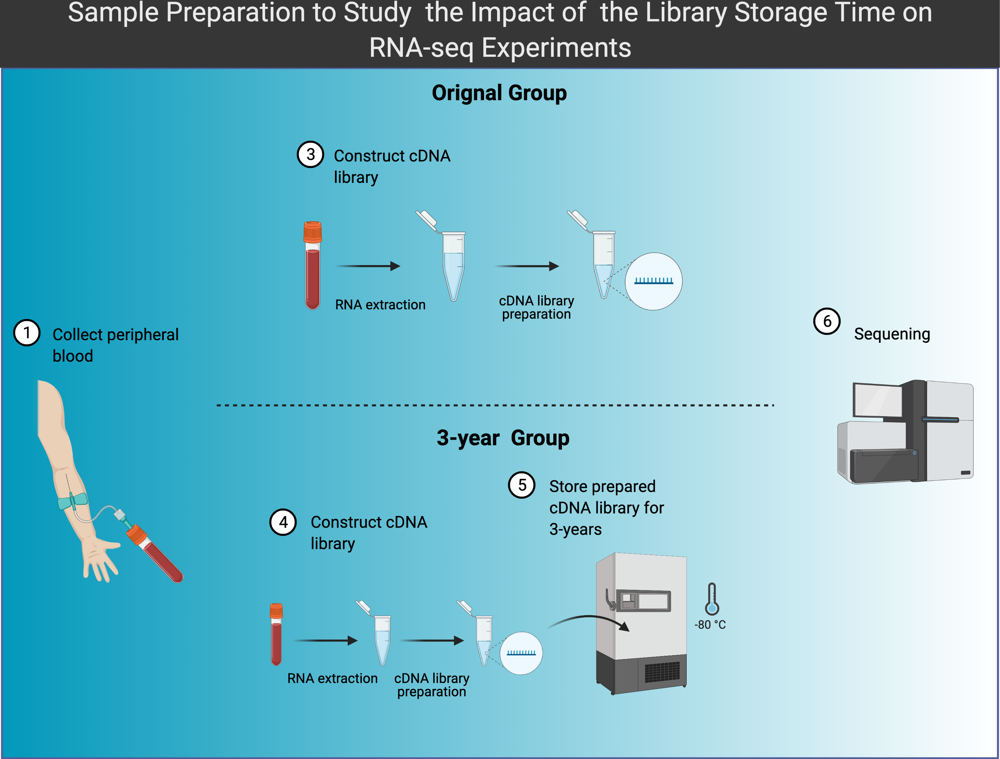{width=80%}


First, I investigated the potential differences of sequencing biases between the two groups. For that I looked at the percentage of mapped reads across different genomic regions (i.e., intronic, exonic, intergenic and other regions) as shown in the Figure below. we can see that the distribution of the reads across genomic regions has little to no difference between the two groups. 

```{r, echo=FALSE}
# Read data from multiqc reports
multiqc_star <- read.csv("../project/multiqc/multiqc_data/multiqc_star.txt", sep='\t')
multiqc_star <- separate(multiqc_star[-c(1:8), ], Sample, c("Sample", "factor", "donor", NA, NA, NA), sep = "_")

read_dist <- read.csv("../project/multiqc/multiqc_data/multiqc_rseqc_read_distribution.txt", sep='\t')
read_dist <- merge(y = read_dist, x = multiqc_star[,c("Sample", "factor",'donor')], by = "Sample", all.x = TRUE)
```

```{r, fig.width=7, fig.height=4}
read_dist[c('ID', "cond")]<- t(sapply(read_dist$donor, function(s) substring(s, c(1,4), c(3,6))))
pct_cols <- colnames(read_dist)[grepl("_pct", colnames(read_dist))]
df_read <- read_dist[(read_dist$cond == "FR") | (read_dist$cond == "SR") | (read_dist$cond == "SRN"), c("Sample","factor","donor", "ID", "cond",pct_cols )]
df_read <- gather(df_read, key="region", value="prct", X3_utr_exons_tag_pct:other_intergenic_tag_pct )
df_read$region <- gsub("_tag_pct", "", df_read$region)
old_regions <- unique(df_read$region)
new_regions <- c("3'UTR_Exons", "TES_down_5kb", "TSS_up_5kb","TES_down_1kb","CDS_exons", "5'UTR_exons","TSS_up_10kb","Introns","TSS_up_1kb","TES_down_10kb","Other_Intergenic")
mappings <- setNames(new_regions, old_regions)
args <- c(list(df_read$region), mappings)
df_read$region <- do.call(recode, args)

ggplot(df_read, aes(x=donor, y=prct, fill=region)) +
        scale_fill_brewer( type='div', palette = "RdYlBu") +
         geom_bar(position="stack", stat="identity") + 
        theme(plot.title = element_text(hjust = 0.5, face='bold'),
              legend.position="bottom", 
              axis.text=element_text(size=9, face='bold'),
              axis.title=element_text(size=12,face="bold"), 
              axis.text.x = element_text(angle = 0, vjust = 0.5, hjust=1))+ 
  
  xlab("Sample") + ylab("Percentages") +labs(title="Read Distribution")
```


We also looked at the gene body coverage to see if there are any pronounce differences. The figure below shows the gene body coverage between the two groups. We see no differences between the two groups.


```{r, fig.width=6, fig.height=4}
data <- fromJSON(file = "../project/multiqc/multiqc_data/multiqc_data.json")

gene_body_prc <- data$report_plot_data$rseqc_gene_body_coverage_plot$datasets[[1]]
gene_body_prc <- lapply(gene_body_prc, function(x) x$data)
gene_body_prc <- lapply(gene_body_prc, function(x) sapply(x, function(s) s[2]))

df <- data.frame(gene_body_prc)
colnames(df) <- read_dist$donor
df$x <- seq(1:100)
df <- gather(df, key = "Sample", value = "gene_body_prc", -x)
df[c('ID', "cond")]<- t(sapply(df$Sample, function(s) substring(s, c(1,4), c(3,6))))

df_time <-  df[(df$cond == "FR") | (df$cond == "SR") | (df$cond == "SRN"), ]
     
p1 <- ggplot(df_time, aes(x = x, y = gene_body_prc, group=Sample, color=cond)) + 
  geom_line()+ 
  theme( plot.title = element_text(hjust = 0.5, face='bold'),
         axis.text=element_text(size=9, face='bold'),
        axis.title=element_text(size=12,face="bold"), 
        axis.text.x = element_text(angle = 0, vjust = 0.5, hjust=1))+ 
  xlab("Gene Body Percentile (5' -> 3')") + ylab("%Coverage") +labs(title="Gene Body Coverage")+
  scale_colour_brewer( type='div', palette = "Set1")

p1 

```


### Gene Level Charachterization


In this section we look at the gene expression abundance and differentially expressed genes between the two groups. First, we used CPM normalized count to compare the gene counts between the samples of the two groups. The density distribution of gene expression values was highly similar between all the samples. The expression of the genes that are either protein coding or lincRNA was concordant between all the samples as shown in the figures below.  


```{r}
folder <- "./"
readcounts <- paste0(folder,"geneCounts_v2.txt") %>% read.table(., header=TRUE) 
readcounts <- readcounts[, -c(7)]
keep_cols <- colnames(readcounts)[grepl("time", colnames(readcounts))]
readcounts <- readcounts[, c(names(readcounts)[1:6], keep_cols)]
sample_names <- unlist(lapply(strsplit(colnames(readcounts)[7:19], "[.]"), function(x) x[5]))
sample_names <- unlist(lapply(strsplit(sample_names, "_"), function(x) paste(x[2:(length(x)-3)], collapse="_")))
names(readcounts) <- c(names(readcounts)[1:6], sample_names)
row.names(readcounts) <- make.names(readcounts$Geneid)
readcounts <- readcounts[ , -c(1:6)]
```


```{r, echo=F}
gene_symbol <- mapIds(EnsDb.Hsapiens.v86,
       keys = rownames(readcounts),
       column = c("SYMBOL"),
       keytype = "GENEID")
edb <- EnsDb.Hsapiens.v86
gene_details <- AnnotationDbi::select(edb, keys=names(gene_symbol), column= c("TXBIOTYPE"),
       keytype="GENEID")

## keep only GENEID that for protein coding and lincRNA genes 
gene_details <- gene_details[gene_details$TXBIOTYPE %in% c("protein_coding", 'lincRNA'), ]
```


```{r, echo=F}
# Create a data frame that contains information for each sample (i.e sample ID,donor ID,  factor:(time, frozen), condition)
sample_info <- data.frame(Sample = names(readcounts), row.names = names(readcounts) )
sample_info <- separate(sample_info, Sample, c("factor", "donor"), sep = "_")
sample_info[c('ID', "cond")]<- t(sapply(sample_info$donor, function(s) substring(s, c(1,4), c(3,6))))
sample_info <- DataFrame(sample_info)
rownames(sample_info) <- sample_info$donor
```

```{r, echo=F}
# Create DESeq object for our RNA-seq data
DESeq.ds <- DESeqDataSetFromMatrix(countData = readcounts, colData = sample_info, design = ~ cond)

# Add gene Symbol to rowData data frame 
rowData(DESeq.ds)$GENESYMBOL <- gene_symbol

# Filter unexpressed genes
keep_genes <- rowSums(counts(DESeq.ds)) > 0
DESeq.ds <- DESeq.ds[ keep_genes, ] 
```

```{r, echo=F}
# For this our question of interest, we should use CPM normalization for gene count comparisons between samples of the same group
assay(DESeq.ds, "CPM") <- edgeR::cpm(counts(DESeq.ds, normalized = FALSE))
```

```{r, fig.width=6, fig.height=4}
cpm <- data.frame(assay(DESeq.ds, "CPM") )
colnames(cpm) <- colnames(DESeq.ds)
cpm$GENEID <- rownames(cpm)
df_cpm <- cpm %>%
  gather(colnames(cpm), key = "Sample", value = "CPM", -GENEID)
df_cpm[c('ID', "cond")]<- t(sapply(df_cpm$Sample, function(s) substring(s, c(1,4), c(3,6))))
ggplot(df_cpm, aes(x=CPM,group=Sample, color=cond )) + 
  geom_density() +
  scale_color_brewer( type='div', palette = "Set1") +
  geom_rug(sides="b") + 
  scale_x_log10()+
  theme(plot.title = element_text(hjust = 0.5, face='bold'))+
  labs(title='Density distribution of the gene CPM value of all samples', caption = "FR:original libraries; SR:3-year stored libraries")+
  ylab('Density')
```

```{r, fig.width=9, fig.height=4}

p1 <- ggplot(df_cpm, aes(y=log10(CPM), x=Sample, fill=cond )) +
  geom_boxplot() +
  scale_fill_brewer( type='div', palette = "Set1") +
  theme(plot.title = element_text(hjust = 0.5, face='bold'),
        axis.text=element_text(size=9, face='bold'),
        axis.title=element_text(size=12,face="bold"), 
        axis.text.x = element_text(angle = 90, vjust = 0.5, hjust=1))+
  labs(title="Distribution of the gene CPM value of all samples")

df_cpm2 <- merge(x= df_cpm, y= gene_details, by = "GENEID", all.x = TRUE)

p2 <- ggplot(df_cpm2[!is.na(df_cpm2$TXBIOTYPE), ], aes(y=log10(CPM), x=TXBIOTYPE, fill=Sample)) +
  geom_boxplot() +
  scale_fill_brewer( type='div', palette = "RdYlBu") +
  theme(plot.title = element_text(hjust = 0.5, face='bold'),
        axis.text=element_text(size=11, face='bold'),
        axis.title=element_text(size=9,face="bold"), 
        axis.text.x = element_text(angle = 0, vjust = 0.5, hjust=1))+
  xlab(label = "") + labs(title= "Comparison of the CPM values between\n lincRNAs and protein-coding genes ", caption = "FR:original libraries; SR:3-year stored libraries")

(p1 | p2)  + plot_annotation(tag_levels = 'A')
```


Furthermore, three RNA libraries of donor ID:107 (i.e., 107FR for the original library, 107SR for the 3-year library, and 107SRN for the new constructed library from the same RNA after three years), exhibited highly correlated expression patterns as shown in the following figure.


```{r, fig.width=9, fig.height=4}
df <- DESeq.ds[, c("107SR","107FR")] %>% assay(., "CPM") %>% data.frame
colnames(df) <-  c("107SR","107FR")

p1 <- ggplot(df, aes(x=`107SR`, y=`107FR`)) + geom_point(size=3)+
  stat_smooth(method="lm", se=FALSE, formula = y ~ x) +
  stat_fit_glance( aes(label = sprintf('r^2~"="~%.3f~~italic(P)~"="~%.2g', stat(r.squared), stat(p.value))), parse = TRUE, size = 5)

df <- DESeq.ds[, c("107SR","107SRN")] %>% assay(., "CPM") %>% data.frame
colnames(df) <-  c("107SR","107SRN")

p2 <- ggplot(df, aes(x=`107SR`, y=`107SRN`)) + geom_point(size=3)+
  stat_smooth(method="lm", se=FALSE, formula = y ~ x) +
  stat_fit_glance( aes(label = sprintf('r^2~"="~%.3f~~italic(P)~"="~%.2g', stat(r.squared), stat(p.value))), parse = TRUE, size = 5)


df <- DESeq.ds[, c("107FR","107SRN")] %>% assay(., "CPM") %>% data.frame
colnames(df) <-  c("107FR","107SRN")

p3 <- ggplot(df, aes(x=`107FR`, y=`107SRN`)) + geom_point(size=3)+
  stat_smooth(method="lm", se=FALSE, formula = y ~ x) +
  stat_fit_glance( aes(label = sprintf('r^2~"="~%.3f~~italic(P)~"="~%.2g', stat(r.squared), stat(p.value))), parse = TRUE, size = 5)

(p1 | p2 | p3) + plot_annotation(tag_levels = 'A')
```


Next, we looked at the PCA clustering of the samples to see if they cluster based on the condition (i.e., original library, stored library) or the patient/donor. The PCA plot suggests that the two RNA-seq samples from the same patient are closest despite the difference of their storage conditions. The same thing is shown by looking at the pearson correlation matrix between the samples and the hierarchical clustering as shown in the figures below. For the three plots I used rlog transformed counts since we are comparing the gene expression profiles between samples.


```{r, fig.width=6, fig.height=4}
# For PCA and DE analysis the rlog normalized counts are used.

DESeq.rlog <- rlog(DESeq.ds, blind = TRUE)

rv <- rowVars(assay(DESeq.rlog))

# Obtain the indecies of the top 500 variable genes
top_variable <- order(rv, decreasing = TRUE)[seq_len(500)]

# Compute the PCAs based on the rlog normalized gene expression
pca <- prcomp(t(assay(DESeq.rlog)[top_variable, ]))

# data.frame contains informtion for each sample. it will be used for PCA plot
data <- data.frame(colData(DESeq.ds))
# Rename columns 
colnames(data) <- c("factor","donor", "ID", "Condition" )

# Plot the two top PCs
p1 <- autoplot(pca, data=data, colour = 'Condition', label = TRUE, label.size = 4, shape = FALSE) +
  scale_colour_brewer( type='qual', palette = "Set1") +
  theme_classic()+
  theme(legend.position = "none", 
        plot.title = element_text(hjust = 0.5, face='bold')) + 
  labs(title="PCA plot for Library Storage Time Imapct Samples", caption = "FR:original libraries; SR:3-year libraries")
p1
```

```{r heatmap plot , fig.width=6, fig.height=4}

sample_df <- as.data.frame(colData(DESeq.ds)[c('ID','cond')])
colnames(sample_df) <- c('Donor ID', 'Condition')
ann_colors = list(Condition = c(FR = "#8DA0CB", SR = "#FC8D62", SRN="#66C2A5"))

corr_coeff <- cor(assay(DESeq.rlog), method = "pearson") 

p1 <- as.dist(1-corr_coeff, upper = TRUE) %>% 
  as.matrix %>%
pheatmap::pheatmap(., main = "Pearson Distance", annotation_row = sample_df, annotation_colors = ann_colors)

```


```{r, fig.width=6, fig.height=4}
# Run pvclust 
d.pv <- as.dendrogram(pvclust(corr_coeff, nboot=10, quiet=T)$hclust)
ddata <- dendro_data(d.pv, type = "rectangle")
# Get data frames to plot
df_seg <- segment(ddata)
df_labs <- data.frame(label(ddata), ID = as.factor(sample_df[match(label(ddata)$label, rownames(sample_df)), "Donor ID"]))

# Create ggplot dendrogram
p <- ggplot()+ 
  geom_segment(data = df_seg,
               aes(x = x, y = y, xend = xend, yend = yend),
               size = 1.25,
               colour = "darkgray", lineend = "round") +
  geom_text(data = df_labs, aes(x = x, y = y, label = label, colour = ID), 
            nudge_y = 0,
            family = "serif", size = 4, angle = 90, hjust = 1, fontface='bold') + 
  scale_colour_brewer( type='div', palette = "Dark2") +
  xlab("") + ylab("Height")
p <- p + theme(axis.line.x = element_blank(),
               axis.text.x = element_blank(),
               axis.ticks.x = element_blank(),
               text = element_text(family = "serif")) +
  # theme_gray()+
  scale_y_continuous(expand = expand_scale(add = c(0.25, 0)))+
  theme_classic() + 
  theme(axis.line.x = element_blank(), axis.ticks.x =element_blank(), 
        axis.text.x= element_blank(),legend.position = "none", 
        plot.title = element_text(hjust = 0.5, face='bold')) +
  labs(title = "Cluster Dendrogram")
p
```


Lastly, we looked at the differential gene expression between the original and 3-years group. We found 15 differentially expressed genes between groups. This suggest that cDNA library storage time has not introduced any biases in the samples that may effect the analysis when comparing the samples from different patient. A summary of the DE analysis is shown in the table below.

```{r, fig.width=6, fig.height=4}
DE_ds <- DESeq.ds[, DESeq.ds$cond != "SRN" ]
colData(DE_ds)$cond <- factor(as.character(colData(DESeq.ds[, DESeq.ds$cond != "SRN" ])$cond), levels=c("FR", "SR"))

res <- DESeq(DE_ds)
res_df <- as.data.frame(results(res))
res_df$SYMBOL <- gene_symbol[match(rownames(res_df), names(gene_symbol))]
res_df <- res_df[(res_df$padj < 0.05)  & (!is.na(res_df$padj)), ]
res_df <- res_df[order(res_df$padj),]
kable(res_df) %>% kable_styling() %>% scroll_box(width = "100%", height = "200px")
```

**`r cat('There are',dim(res_df)[1], 'differentially expressed genes between the original and 3-years groups')`**

## The impact of the sample cryopreservation on RNA-seq experiments

Cryopreservation usually results in an increased proportion of damaged cells, which could potentially affect the outputs of RNA-seq experiments. To explore the effect of of sample cryopreservation on RNA-seq output, we investigated the differences between two groups of fresh (i.e. unfrozen group) and cryopreserved (i.e. frozen group) CD4+ blood samples derived from 4 healthy patients, where each subject has both fresh and cryopreserved sample. Figure 13 show an overview of the samples preparation and groups.


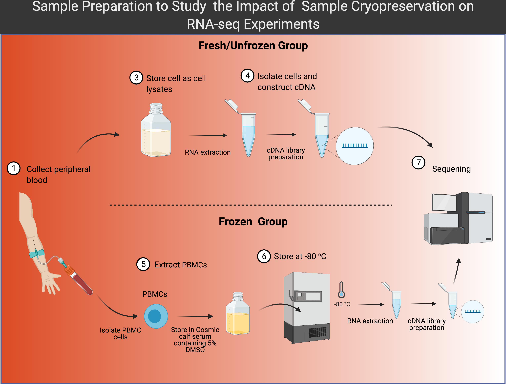{width=80%}


Looking at the percentage of mapped reads across different genomic regions shows no effect of sample cryopreservation on the RNA-seq experiment.


```{r, fig.width=6, fig.height=4}
df_read <- read_dist[(read_dist$cond == "f") | (read_dist$cond == ""), c("Sample","factor","donor", "ID", "cond",pct_cols )]

df_read <- gather(df_read, key="region", value="prct", X3_utr_exons_tag_pct:other_intergenic_tag_pct )
df_read$region <- gsub("_tag_pct", "", df_read$region)
old_regions <- unique(df_read$region)
new_regions <- c("3'UTR_Exons", "TES_down_5kb", "TSS_up_5kb","TES_down_1kb","CDS_exons", "5'UTR_exons","TSS_up_10kb","Introns","TSS_up_1kb","TES_down_10kb","Other_Intergenic")
mappings <- setNames(new_regions, old_regions)
args <- c(list(df_read$region), mappings)
df_read$region <- do.call(recode, args)

ggplot(df_read, aes(x=donor, y=prct, fill=region)) +
        scale_fill_brewer( type='div', palette = "RdYlBu") +
         geom_bar(position="stack", stat="identity") + 
        theme(plot.title = element_text(hjust = 0.5, face='bold'),
              legend.position="bottom", axis.text=element_text(size=10, face='bold'),
              axis.title=element_text(hjust=0.5, size=12,face="bold"), 
              axis.text.x = element_text(angle = 0, vjust = 0.5, hjust=1))+ 
  xlab("Sample") + ylab("Percentages") +labs(title="Read Distribution")

```


The gene body coverage shows a bias towards the 5' end for fresh/unfrozen samples, while the frozen samples show a bias towards the 3' end. But overall the gene body coverage follows the same trend across all the samples.


```{r, fig.width=6, fig.height=4}
library("rjson")
data <- fromJSON(file = "../project/multiqc/multiqc_data/multiqc_data.json")

gene_body_prc <- data$report_plot_data$rseqc_gene_body_coverage_plot$datasets[[1]]
gene_body_prc <- lapply(gene_body_prc, function(x) x$data)
gene_body_prc <- lapply(gene_body_prc,function(x) sapply(x, function(s) s[2]))

df <- data.frame(gene_body_prc)
colnames(df) <- read_dist$donor
df$x <- seq(1:100)
df <- gather(df, key = "Sample", value = "gene_body_prc", -x)
df[c('ID', "cond")]<- t(sapply(df$Sample, function(s) substring(s, c(1,4), c(3,6))))

df_frozen <-  df[(df$cond == "f") | (df$cond == "") , ]
df_frozen <- df_frozen %>%
     mutate(cond=replace(cond, cond=="f", "Frozen")) %>%
     mutate(cond=replace(cond, cond=="", "Unfrozen"))

p1 <- ggplot(df_frozen, aes(x = x, y = gene_body_prc, group=Sample, color=cond)) + 
  geom_line()+ 
  theme( plot.title = element_text(hjust = 0.5, face='bold'),
         axis.text=element_text(size=9, face='bold'),
         axis.title=element_text(size=12,face="bold"), 
         axis.text.x = element_text(angle = 0, vjust = 0.5, hjust=1))+ 
  xlab("Gene Body Percentile (5' -> 3')") + ylab("%Coverage") +labs(title="Gene Body Coverage")+
  scale_colour_brewer( type='div', palette = "Set1")

p1

```

### Gene Level Charachterization

The density distribution of gene expression values was highly concordant between all the samples. The expression of the genes that are either protein coding or lincRNA was similar between all the samples as shown in the figures below.


```{r, echo=F}
folder <- "./"
readcounts <- paste0(folder,"geneCounts_v2.txt") %>% read.table(., header=TRUE) 
readcounts <- readcounts[, -c(7)]
keep_cols <- colnames(readcounts)[grepl("frozen", colnames(readcounts))]
readcounts <- readcounts[, c(names(readcounts)[1:6], keep_cols)]
sample_names <- unlist(lapply(strsplit(colnames(readcounts)[7:14], "[.]"), function(x) x[5]))
sample_names <- unlist(lapply(strsplit(sample_names, "_"), function(x) paste(x[2:(length(x)-3)], collapse="_")))

names(readcounts) <- c(names(readcounts)[1:6], sample_names)
row.names(readcounts) <- make.names(readcounts$Geneid)
readcounts <- readcounts[ , -c(1:6)]
```


```{r, echo=FALSE}
# Create a data frame that contains information for each sample (i.e sample ID,donor ID,  factor:(time, frozen), condition)
sample_info <- data.frame(Sample = names(readcounts), row.names = names(readcounts) )
sample_info <- separate(sample_info, Sample, c("factor", "donor"), sep = "_")
sample_info[c('ID', "cond")]<- t(sapply(sample_info$donor, function(s) substring(s, c(1,4), c(3,6))))
sample_info <- sample_info %>%
     mutate(cond=replace(cond, cond=="f", "Frozen")) %>%
     mutate(cond=replace(cond, cond=="", "Unfrozen"))

sample_info <- DataFrame(sample_info)
rownames(sample_info) <- sample_info$donor
```

```{r, echo=F}
# Create DESeq object for our RNA-seq data
DESeq.ds <- DESeqDataSetFromMatrix(countData = readcounts, colData = sample_info, design = ~ cond)

# Add gene Symbol to rowData data frame 
rowData(DESeq.ds)$GENESYMBOL <- gene_symbol

# Filter unexpressed genes
keep_genes <- rowSums(counts(DESeq.ds)) > 0
DESeq.ds <- DESeq.ds[ keep_genes, ] 
```

```{r, echo=FALSE}
# For this our question of interest, we should use CPM normalization for gene count comparisons between samples of the same group
assay(DESeq.ds, "CPM") <- edgeR::cpm(counts(DESeq.ds, normalized = FALSE))
```

```{r, fig.width=6, fig.height=4}
cpm <- data.frame(assay(DESeq.ds, "CPM") )
colnames(cpm) <- colnames(DESeq.ds)
cpm$GENEID <- rownames(cpm)
df_cpm <- cpm %>%
  gather(colnames(cpm), key = "Sample", value = "CPM", -GENEID)
df_cpm[c('ID', "cond")]<- t(sapply(df_cpm$Sample, function(s) substring(s, c(1,4), c(3,6))))
df_cpm <- df_cpm %>%
     mutate(cond=replace(cond, cond=="f", "Frozen")) %>%
     mutate(cond=replace(cond, cond=="", "Unfrozen"))

ggplot(df_cpm, aes(x=CPM,group=Sample, color=cond )) + 
  geom_density() +
  scale_color_brewer( type='div', palette = "Set1") +
  geom_rug(sides="b") + 
  scale_x_log10()+
  theme(plot.title = element_text(hjust = 0.5, face='bold'))+
  labs(title='Density distribution of the gene CPM value of all samples', caption = "Frozen:cryopreserved samples, Unfrozen: fresh samples")+
  ylab('Density')

```

```{r, fig.width=7, fig.height=4}
p1 <- ggplot(df_cpm, aes(y=log10(CPM), x=Sample, fill=cond )) +
  geom_boxplot() +
  scale_fill_brewer( type='div', palette = "Set1") +
  theme(axis.text=element_text(size=9, face='bold'),
        axis.title=element_text(size=12,face="bold"), 
        axis.text.x = element_text(angle = 90, vjust = 0.5, hjust=1))+
  labs(title="Distribution of the gene CPM value of all samples")

df_cpm2 <- merge(x= df_cpm, y= gene_details, by = "GENEID", all.x = TRUE)

p2 <- ggplot(df_cpm2[!is.na(df_cpm2$TXBIOTYPE), ], aes(y=log10(CPM), x=TXBIOTYPE, fill=Sample)) +
  geom_boxplot() +
  scale_fill_brewer( type='div', palette = "RdYlBu") +
  theme(plot.title = element_text(hjust = 0.5, face='bold'),
        axis.text=element_text(size=11, face='bold'),
        axis.title=element_text(size=12,face="bold"), 
        axis.text.x = element_text(angle = 0, vjust = 0.5, hjust=1))+
  xlab(label = "") + labs(title= "Comparison of the CPM values between\nlincRNAs and protein-coding genes ", caption = "Frozen:cryopreserved samples, Unfrozen: fresh samples")

(p1 | p2)  + plot_annotation(tag_levels = 'A')

```


The PCA plot suggest that the two RNA-seq samples from same individuals were more similar than those under same cryopreserved conditions. The same thing is shown by looking at the pearson correlation matrix between the samples and performing hierarchical clustering, except for the fresh sample from donor 501 that was clustered away from its frozen sample as shown in the figures below.

```{r, fig.width=6, fig.height=4}
# For PCA analysis the rlog normalized counts are used.

DESeq.rlog <- rlog(DESeq.ds, blind = TRUE)

rv <- rowVars(assay(DESeq.rlog))

# Obtain the indecies of the top 500 variable genes
top_variable <- order(rv, decreasing = TRUE)[seq_len(500)]

# Compute the PCAs based on the rlog normalized gene expression
pca <- prcomp(t(assay(DESeq.rlog)[top_variable, ]))

# data.frame contains informtion for each sample. it will be used for PCA plot
data <- data.frame(colData(DESeq.ds))
# rename columns 
colnames(data) <- c("factor","donor", "ID", "Condition" )

# Plot the two top PCs
p1 <- autoplot(pca, data=data, colour = 'Condition', label = TRUE, label.size = 4, shape = FALSE) +
  scale_colour_brewer( type='qual', palette = "Set1") +
  theme_classic()+
  theme(plot.title = element_text(hjust = 0.5, face='bold'),
        legend.position="bottom") + 
  labs(title="PCA plot for Cryopreservation Imapct Samples", caption = "Frozen:cryopreserved samples, Unfrozen: fresh samples")

p1
```

```{r, fig.width=6, fig.height=4}

sample_df <- as.data.frame(colData(DESeq.ds)[c('ID','cond')])
colnames(sample_df) <- c('Donor ID', 'Condition')
ann_colors = list(Condition = c(Frozen = "#8DA0CB", Unfrozen = "#FC8D62"))

corr_coeff <- cor(assay(DESeq.rlog), method = "pearson") 

p1 <- as.dist(1-corr_coeff, upper = TRUE) %>% 
  as.matrix %>%
pheatmap::pheatmap(., main = "Pearson Distance", annotation_row = sample_df, annotation_colors = ann_colors)

```

```{r, fig.width=6, fig.height=4}
# Run pvclust 
d.pv <- as.dendrogram(pvclust(corr_coeff, nboot=10, quiet=T)$hclust)
ddata <- dendro_data(d.pv, type = "rectangle")
# Get data frames to plot
df_seg <- segment(ddata)
df_labs <- data.frame(label(ddata), ID = as.factor(sample_df[match(label(ddata)$label, rownames(sample_df)), "Donor ID"]))

# Create ggplot dendrogram
p <- ggplot()+ 
  geom_segment(data = df_seg,
               aes(x = x, y = y, xend = xend, yend = yend),
               size = 1.25,
               colour = "darkgray", lineend = "round") +
  geom_text(data = df_labs, aes(x = x, y = y, label = label, colour = ID), 
            nudge_y = 0,
            family = "serif", size = 4, angle = 90, hjust = 1, fontface='bold') + 
  scale_colour_brewer( type='div', palette = "Dark2") +
  xlab("") + ylab("Height")
p <- p + theme(axis.line.x = element_blank(),
               axis.text.x = element_blank(),
               axis.ticks.x = element_blank(),
               text = element_text(family = "serif")) +
  # theme_gray()+
  scale_y_continuous(expand = expand_scale(add = c(0.25, 0.5)))+ 
  theme_classic() + 
  theme(axis.line.x = element_blank(), axis.ticks.x =element_blank(), 
        axis.text.x= element_blank(),legend.position = "none", 
        plot.title = element_text(hjust = 0.5, face='bold')) +
  labs(title = "Cluster Dendrogram")

p
```


Lastly, we looked at the differential gene expression between the fresh and frozen group. We found 71 differentially expressed genes between groups. This suggest that sample cryopreservation has introduced some biases in the samples. This requires a look at the genes that were differentially expressed and see if they are random or they share a similar characteristics. A summary of the DE analysis is shown in the table below.


```{r, fig.width=6, fig.height=4}

colData(DESeq.ds)$cond <- factor(as.character(colData(DESeq.ds)$cond), levels=c("Unfrozen", "Frozen"))

res <- DESeq(DESeq.ds)
res_df <- as.data.frame(results(res))
res_df$SYMBOL <- gene_symbol[match(rownames(res_df), names(gene_symbol))]
res_df <- res_df[(res_df$padj < 0.05) & (!is.na(res_df$padj)), ]
res_df <- res_df[order(res_df$padj),]
kable(res_df) %>% kable_styling() %>% scroll_box(width = "100%", height = "200px")
```


# Discussion

In this study we investigated the effects of two sample preparation factors on RNA-seq experiment, and found that these factors did not affect the downstream gene expression analysis. Overall, the analysis pipeline follows standard pipeline for RNA-seq analysis, but there were some issues and problems that I encountered along the way: 

1. Figure out the right way to compare the samples from different conditions to get the answer for the our question. First, I looked at the read counts and the distribution of the reads from the QC tools, then I didn't know what else I should inspect. Then I took some pointers from the original paper [@wang_exploring_2019] to complete the analysis.
2. Normalization: The original paper used CPM normalized counts in some part of the analysis. At first it seemed the wrong thing to do since we are comparing different samples, then I understood that CPM was used for gene count comparisons between replicates of the same sample group, in our case the replicates were under two conditions (original vs 3-years stored and fresh vs frozen). But when I get to clustering and DE analysis, the CPM count seemed to be influenced by the conditions not the individual patient sample, but once I used the rlog normalized counts the results suggested otherwise.
3. Understanding the details of the sample cryopreservation experiment. There are some technical details concerning fresh RNA samples that I'm not confident about, that is how was the cell lysates used to derive fresh RNA-seq stored and how it differs from Cosmic calf serum that was used to freeze the peripheral blood mononuclear cells.


# References
